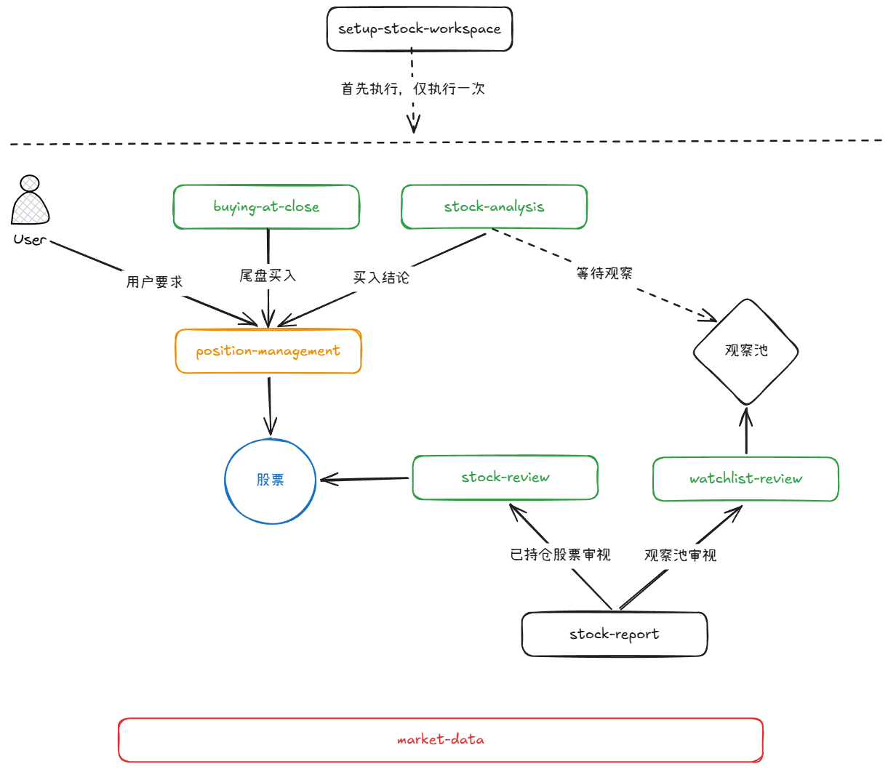

# stock-skills — A股交易 Codex Skills 集合

中文 A 股实盘交易辅助的 Codex skills 集合：核心闭环覆盖「个股分析 → 交易计划 → 建仓/持仓 → 清仓复盘 → 统计归档」，龙头扫描（leader-catch）与尾盘买入审视（buying-at-close）是两个可选决策入口。每个 skill 独立自包含（SKILL.md + references + scripts），真实数据统一由 market-data 拉取（腾讯行情 + 东方财富行情/板块/财报/新闻/资金流公开接口）并输出数据报告，无需密钥。

当前版本：3.2.2 · [查看发布记录](https://github.com/ddd-online/stock-skills/releases)

## Skills 一览

| Skill | 定位 | 作用 |
|---|---|---|
| [market-data](market-data/) | 数据层 | 统一拉取 A 股真实行情、财报、新闻公告、资金流向、强势股榜单、板块行情榜/成分股榜/板块财务排名、涨停板数据并输出数据报告，供其他 skill 调用 |
| [stock-analysis](stock-analysis/) | 个股分析与信号 | 结合工作区账户/持仓/笔记，全面分析一只 A 股并输出建仓/加仓/减仓/空仓信号（观察为等待中间态）：证据先行、结论最后（基本面/技术面/支撑压力/事件与资金面/风险），检查近期新闻/公告（逻辑证伪）与资金流向；附支撑位/压力位、买点、止损、止盈锚点与盈亏比；建仓/加仓信号输出六格清单分析（不落盘，交接给 position-management 汇总进 STOCK-REVIEW.md 交易计划） |
| [buying-at-close](buying-at-close/) | 尾盘执行入口 | 14:30 后拉取大盘与强势股榜（默认换手 5%–30%）快筛候选，盘口初审后逐只经 $stock-analysis 全面分析（建仓信号为买入前提），按 MUST「尾盘买入法执行规则」输出「买入/不买」报告并写入 report/尾盘买入审视/YYYY-MM-DD.md；买入结论附次日止损止盈规则（9:25 竞价处理、1-3 日时间止损）；MUST 缺该节时补一节并写入默认条件阈值 |
| [leader-catch](leader-catch/) | 龙头扫描入口 | 识别市场活跃板块或指定板块/题材里的行业龙头（基本面第一梯队）与人气龙头（板块相对最强，四查两两打分），报告把「最强」与「值得买」分开标注，写入 report/龙头扫描/YYYY-MM-DD.md；只出扫描结论不下单，深查交接 $stock-analysis，仓位与观察池分别走 $position-management / $watchlist-review |
| [limit-up](limit-up/) | 涨停情绪复盘 | 复盘涨停/跌停/炸板家数与封板率、连板高度与最高板（一字核对）、昨日涨停今日晋级表现与炸板潮，并把当日主线板块与板块行情榜（板块行）合并写入 report/涨停板复盘/YYYY-MM-DD.md；只出数据判定，不下单不预测 |
| [find-simmer](find-simmer/) | 蓄力票发现 | 先执行 $leader-catch 做强势板块分析，再在板块内发现“1周到本月缓慢上涨”的蓄力票——A 型回踩蓄力（高点回落后缩量企稳）/ B 型缓涨蓄力（沿均线慢涨抗跌），按大盘环境适配后写入 report/蓄力票扫描/YYYY-MM-DD.md；只做发现筛选，不输出买卖信号 |
| [watchlist-review](watchlist-review/) | 观察池审视 | 逐只调用 stock-analysis 分析池中标的，按结论更新状态（信号触发/等待/移除）并回写 WATCHLIST.md |
| [stock-review](stock-review/) | 持仓每日检查 | 按收盘复盘规范输出该股第 3–5 步（个股触发判断/量价四句/明日预案行），结果与明日预案追加 STOCK-REVIEW.md，供 stock-report 收盘版汇总 |
| [stock-report](stock-report/) | 每日复盘 | 午间 11:45 精简版 / 收盘 15:15 完整版：收盘版按 大盘→板块→个股→量价→预案 五步做收盘复盘（大盘/板块由本 SKILL 分析，个股/量价/预案来自 $stock-review）+ 观察池审视（$watchlist-review）+ 生成复盘报告写入 report/股票午间复盘/ 或 report/股票每日复盘/，配置邮箱时经 agently-mail 同步发送 |
| [position-management](position-management/) | 资金与持仓档案 | 每次动作前输出资金调度卡（现金储备≥实际可用资产30%、单笔预算≤实际可用资产2%降档1%；实际可用资产=本金+总盈亏−累计支取），处理建仓/加仓/减仓/空仓/清仓（建仓时创建 STOCK-REVIEW.md 写入交易计划、创建 TRADE-SUMMARY.md）、平仓复盘与总结并归档；清仓时计算胜率/平均盈亏/期望值/最大回撤四指标写入 TRADE-STATS.md |
| [setup-stock-workspace](setup-stock-workspace/) | 一次性初始化 | 创建工作区目录与种子文件，收集交易费用设置，并把目录/文件规则、SKILL 版本与升级约束、条件单规则与状态更新规则写入 AGENTS.md |

## 安装（Codex）

在 Codex 中粘贴下面的提示词，Codex 会用 $skill-installer 从本仓库下载并安装全部 skill（需网络，公开仓库默认直连下载）：

```
使用 $skill-installer 从 GitHub 仓库 ddd-online/stock-skills 安装以下 skills：market-data、stock-analysis、buying-at-close、leader-catch、limit-up、find-simmer、watchlist-review、stock-review、stock-report、position-management、setup-stock-workspace
```

安装位置：`$CODEX_HOME/skills/<skill-name>`（默认 `~/.codex/skills`）。安装后下一个会话即可用 `$skill-name` 调用：

```
使用 $leader-catch 扫描今天市场最活跃板块的行业龙头与人气龙头，把「最强」和「值得买」分开
使用 $limit-up 复盘今日涨停板：涨停跌停家数、最高几板、晋级率与炸板潮、当日主线板块
使用 $find-simmer 在今日强势板块里找蓄力票（先执行 $leader-catch）
使用 $stock-analysis 分析 sh600410 该建仓还是空仓
使用 $buying-at-close 做今天 14:45 的尾盘买入审视
使用 $stock-report 做今天的收盘复盘
```

也可以直接 clone 本仓库，把需要的 skill 文件夹复制到 `~/.codex/skills/`。

## 依赖

- Python 3（纯标准库，无第三方依赖）
- 网络连接（数据接口：腾讯行情 `qt.gtimg.cn` / `web.ifzq.gtimg.cn`；东方财富行情/板块/资金流 `push2.eastmoney.com` / `push2delay.eastmoney.com`、财报 `datacenter-web.eastmoney.com`、新闻/公告 `search-api-web.eastmoney.com` / `np-anotice-stock.eastmoney.com`）
- 数据接口免费、无需密钥；接口不可用时 skill 明确报错，不编造数据

## 交易流程



流程图含义：setup-stock-workspace 只执行一次；之后每个交易日从“入口”进入分析线——入口有三个：用户直接要求分析个股、$leader-catch 龙头扫描、$buying-at-close 尾盘审视；“买入结论”经 position-management 落到股票持仓，“等待观察”进观察池；已持仓与观察池分别由 stock-review、watchlist-review 审视并回写，stock-report 把两条审视结果汇总为复盘报告与明日预案，形成“当日复盘 → 次日 9:25 执行”的循环。

stock-analysis 在输出「建仓/加仓」信号时完成六格清单分析（选什么/何时买/买多少/错了怎么办/对了怎么办/交易后，不落盘），交接给 position-management；STOCK-REVIEW.md「交易计划」是该股唯一落盘的规则来源（六格要素 + 资金调度结果：金额/手数/费用/最大亏损/盈亏比），持仓期间遵守、不临时修改。position-management 做资金调度确认并执行建仓/加仓——建仓执行时创建 STOCK-REVIEW.md（写入交易计划）与 TRADE-SUMMARY.md（追加买入记录）；「减仓/空仓」信号直接由 position-management 做资金调度（减仓/清仓）。持仓期间的每日检查由 stock-review 负责（只向既有 STOCK-REVIEW.md 追加每日检查行），清仓后的平仓复盘与总结（只写 TRADE-SUMMARY.md——四层复盘总结——随后归档）由 position-management 负责。

leader-catch 是可选的“龙头扫描”入口（不属于每日闭环）：扫描市场活跃板块/指定题材的行业龙头与人气龙头，报告把「最强」与「值得买」分开；值得深查的候选先经 stock-analysis 出建仓/空仓信号，再决定进观察池（watchlist-review）或建仓（position-management），禁止跳过体检直接按“龙头”买入。

limit-up 是可选的“涨停板情绪复盘”入口（不属于每日闭环）：用涨停/跌停/炸板家数、连板高度、晋级率与炸板率描述当日情绪与主线；报告写入 report/涨停板复盘/YYYY-MM-DD.md，只做数据复盘，买卖判断仍走 stock-analysis → position-management。

find-simmer 是可选的“蓄力票发现”入口（不属于每日闭环）：必须先执行 leader-catch 做强势板块分析，再在板块内筛 A/B 型蓄力票并写 report/蓄力票扫描/YYYY-MM-DD.md；发现结果只作候选，是否值得买仍走 stock-analysis → position-management。

每笔清仓后 position-management 把交易记录写入根目录 TRADE-STATS.md，每 5-10 笔结算胜率、平均盈亏、期望值、最大回撤，用统计判断系统是否有效、下一步该改哪一端（入场端/出场端），一次只改一条规则。

空仓期/等待期：$watchlist-review 审视观察池——逐只调用 $stock-analysis，按信号更新 WATCHLIST.md 状态；没有触发条件不建仓。空仓期间 $stock-report 收盘复盘照常执行（只做大盘/板块 + 观察池），不产生个股预案。

调用约束：
- 前置：除 leader-catch、limit-up（纯数据扫描/复盘，不读取工作区文件，可在任意目录运行）外，其余 SKILL 依赖工作区文件（ACCOUNT.md / NOTES.md / POSITION.md / MUST.md / stocks/），未初始化先运行 $setup-stock-workspace
- 除 leader-catch、limit-up 外，所有 SKILL 必须遵守工作区 MUST.md 中的个人交易风格与规则（默认只有一个标题，由用户编辑）
- leader-catch 只识别龙头并给出「值得进一步评估」名单，不输出买卖结论；候选须经 $stock-analysis 输出建仓信号后才可走 $position-management
- stock-analysis 输出建仓/加仓信号（含六格清单分析）后，才调用 position-management；减仓/空仓信号直接调用 position-management；用户直接请求建仓而 position-management 未收到 stock-analysis 的支撑位/压力位（买点/止损/止盈）分析时，先调用 stock-analysis 获取后再做资金调度
- 资金调度（现金储备、单笔预算、批次、手数）全部由 position-management 确认；stock-analysis 只输出信号、锚点与建议
- STOCK-REVIEW.md 与其交易计划由 position-management 建仓时创建/写入（涉及资金调度）；stock-review 只追加每日检查行
- watchlist-review 审视观察池时逐个自动调用 stock-analysis；观察池进出由 stock-analysis 信号决定（观察→进池等待、空仓信号→移除）
- buying-at-close 快筛出的候选须逐只经 $stock-analysis 输出「建仓信号」后才允许给「买入」结论；尾盘时间/仓位/次日纪律以 MUST「尾盘买入法执行规则」为准
- stock-review 只检查 POSITION.md 中的持仓；触发止损/止盈/时间止损时只给出平仓结论，不强制下单（可能不在交易时段）
- stock-report 每日复盘汇总两条审视线：收盘版按 大盘→板块→个股→量价→预案 组装 $stock-review（已持仓审视）与 $watchlist-review（观察池审视）的输出；复盘报告先写入 report/ 对应子目录，有邮箱时经 $agently-mail 同步发送
- 用户卖出后调用 position-management 告知卖出价，由它按实际成交价结算并完成平仓总结与归档
- stock-analysis 的加仓六格清单分析必须有「加仓」信号、POSITION.md 持仓与既有交易计划（STOCK-REVIEW.md / history 归档），缺一不输出
- 工作区没有 TRADE-RULES.md：六格清单分析由 stock-analysis 输出（不落盘）；交易计划写在 STOCK-REVIEW.md（建仓时），平仓复盘只写 TRADE-SUMMARY.md（均由 position-management 维护）

工作区归档规则由 setup-stock-workspace 写入 AGENTS.md，首次交易前先运行它初始化。

## 项目结构

```
stock-skills/
├── <skill-name>/           # 每个 skill 一个文件夹
│   ├── SKILL.md            # 触发说明与工作流（必读）
│   ├── agents/openai.yaml  # 界面元数据
│   ├── references/         # 中文参考文档（按需加载）
│   └── scripts/            # 各 skill 专属脚本；真实数据脚本集中在 market-data/scripts/（fetch_quote / fetch_fundamentals / fetch_news / fetch_capital_flow / fetch_strong_stocks / fetch_sector_boards / fetch_sector_leaders / fetch_sector_fundamentals / fetch_limit_up）
└── README.md
```

## 免责声明

所有 skill 输出不构成投资建议。股市有风险，投资需谨慎。
